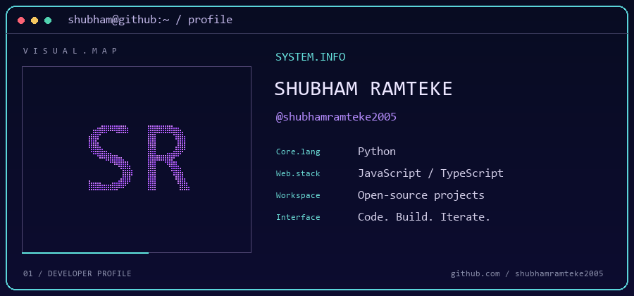
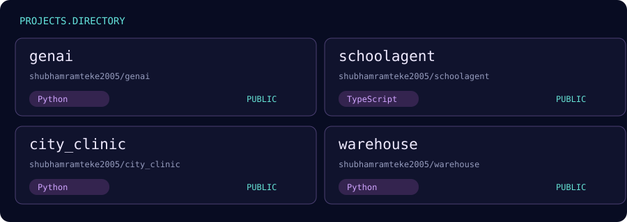

### 01 / About

Hi, I'm **Shubham Ramteke**. My public projects include Python, JavaScript and TypeScript repositories. Explore my work below.

### 02 / Projects

<a href="https://github.com/shubhamramteke2005/genai">genai ↗</a> · <a href="https://github.com/shubhamramteke2005/schoolagent">schoolagent ↗</a> · <a href="https://github.com/shubhamramteke2005/city_clinic">city_clinic ↗</a> · <a href="https://github.com/shubhamramteke2005/warehouse">warehouse ↗</a>

### 03 / GitHub activity

### 04 / Contribution snake

CODE. BUILD. ITERATE.

